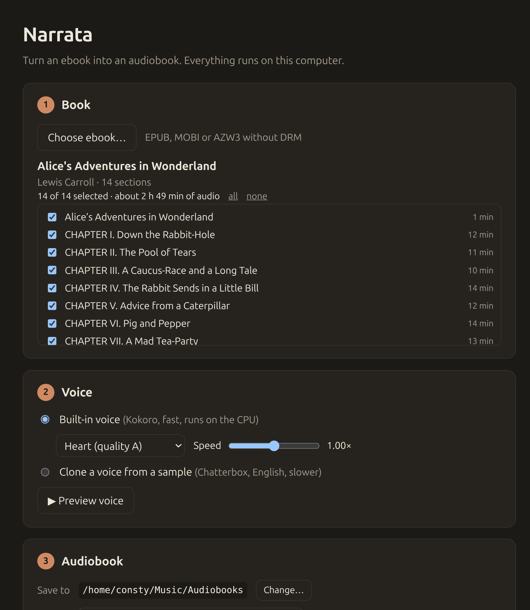

# Booklark

Turn any DRM-free ebook into an audiobook, entirely on your own computer.

Pick an EPUB, MOBI or AZW3, choose a voice, press **Create audiobook**. Booklark reads the book aloud
with a built-in neural voice, or in the voice of anyone who gives you a short recording.

<p align="center">
  
</p>

## Features

- **28 built-in voices** from Kokoro-82M, American and British English, running on the CPU a few times faster than real time.
- **Voice cloning** with Chatterbox Turbo: record ten to twenty seconds of someone speaking, or pick an audio file, and the whole book is narrated in that voice. English only.
- **Compact output**: a single `.m4b` audiobook with chapter markers, or one MP3 or OGG (Opus) file per chapter. Audio is streamed into the encoder as it is narrated, so nothing uncompressed is ever written to disk. WAV is only used when `ffmpeg` is missing.
- **Resumable**: cancel any time. Finished chapters are kept and reused on the next run.
- **Chapter selection**: untick front matter, licence text or anything else you do not want narrated.
- **Voice preview** before committing to a multi-hour conversion.
- **Nothing leaves your machine.** Models are downloaded once and cached locally.

## Requirements

- Node.js 20 or newer (for development and for the CLI).
- `ffmpeg` on the PATH, for M4B, MP3 and OGG output. Without it Booklark falls back to WAV, which needs about 170 MB per hour of audio.
- Optional, for voice cloning: Python 3.10+ with `venv` and `git`.
  On Debian, Ubuntu and Mint: `sudo apt install python3-venv git`.

## Run the app

```sh
npm install
npm start
```

## Bundle a desktop app

```sh
npm run package
```

Produces `dist/Booklark-<platform>-<arch>/` with a `booklark` executable inside. The packaging script
removes ONNX Runtime binaries for other platforms and the CUDA/TensorRT providers, which are most of
the weight of `node_modules`.

## Command line

The CLI drives the same pipeline as the window.

```sh
node cli.js book.epub                                        # list chapters
node cli.js book.epub --out ~/Audiobooks                     # narrate with Kokoro (voice af_heart)
node cli.js book.epub --out ~/Audiobooks --voice bm_george --speed 1.1 --chapters 2-13
node cli.js book.epub --out ~/Audiobooks --ref friend.wav    # clone a voice (after setup in the app)
node cli.js book.epub --out ~/Audiobooks --format ogg        # m4b (default), mp3, ogg or wav
node cli.js book.epub --out ~/Audiobooks --keep-chapters     # keep the per-chapter files next to the .m4b
node cli.js book.epub --out ~/Audiobooks --ref friend.wav --verbose   # show the voice engine's own log
```

A passage the voice engine cannot read is retried once, then skipped with a warning and half a second
of silence, so one odd line never ends a multi-hour job. Three failures in a row stop the run.

Approximate sizes per hour of narration: M4B and MP3 about 30 MB, OGG (Opus) about 18 MB, WAV about 170 MB.

Voice ids are the Kokoro pack names: `af_*` and `am_*` are American female and male, `bf_*` and `bm_*`
are British. See `lib/voices.js` for the full list with Kokoro's quality grades.

## Voice cloning setup

In the app, choose **Clone a voice from a sample** and press **Set up voice cloning**. Booklark creates
a private virtual environment in its data directory and installs PyTorch plus `chatterbox-tts`. The
first synthesis downloads the Chatterbox Turbo model from Hugging Face. Expect around two gigabytes
in total with the CPU build of PyTorch, and three to four with a GPU build.

Cloning on a CPU is considerably slower than Kokoro, roughly real time on a modern laptop. Finished
chapters are kept, so long books can be converted in several sittings.

### GPU acceleration for voice cloning

Setup picks the PyTorch build to match the machine:

| Detected | PyTorch build | How it is detected |
| --- | --- | --- |
| NVIDIA GPU | CUDA 12.6 | `nvidia-smi` runs successfully |
| AMD GPU on Linux | ROCm | `/dev/kfd` exists and a display device reports AMD's vendor id |
| Anything else | CPU | |

At start-up the voice engine tests the GPU in a separate process and uses it only if the test
passes. If the test fails, or the model later fails to load or run on the GPU, the engine switches
to the CPU on its own and carries on. With two GPUs, for example a processor's built-in graphics
next to a discrete card, the one with the most memory is used.

If voice cloning was set up before a GPU was available, or on a Booklark version that only knew
about NVIDIA, the app offers **Set up again for the GPU**. Re-running setup swaps the PyTorch build
in place. Kokoro always runs on the CPU, where it is already several times faster than real time.

Notes for AMD cards: the ROCm wheel bundles the ROCm libraries, so nothing beyond the ordinary open
source `amdgpu` kernel driver has to be installed. Your user must be able to open `/dev/kfd`, which
usually means membership in the `render` group (`sudo usermod -aG render $USER`, then log in
again). AMD ships kernels for a limited set of chips per generation; if the GPU test fails on a
card that should work, setting `HSA_OVERRIDE_GFX_VERSION` (for example `11.0.0` for RDNA3 or
`10.3.0` for RDNA2) in the environment Booklark starts from usually fixes it, and the variable is
passed through to the engine. On macOS the standard wheel is installed and cloning runs on the CPU.

Booklark downloads only the three weight files the Turbo model reads, about 3 GB, rather than the
full 4 GB repository.

Tips for a good sample: ten to twenty seconds, one speaker, no music or background noise, natural
reading pace.

## How it is built

Plain Electron with no bundler, framework or TypeScript. Two runtime dependencies:

| Package | Purpose |
| --- | --- |
| `kokoro-js` | Runs Kokoro through ONNX Runtime inside Node |
| `@huggingface/transformers` | Pulled in by kokoro-js; pinned so the model cache location can be set |

Everything else is Node's standard library.

```
main.js               Electron main process: window, dialogs, IPC, worker lifecycle
preload.js            Sandboxed bridge between the window and the main process
worker.js             Utility process that runs parsing and synthesis off the UI thread
renderer/             The window: one HTML file, one stylesheet, one script
cli.js                Command-line front end to the same pipeline
lib/zip.js            ZIP reader on node:zlib
lib/epub.js           container.xml -> OPF -> spine, chapter titles from nav or NCX
lib/mobi.js           PalmDB records, PalmDOC decompression, KF7 and KF8 text, EXTH metadata
lib/html.js           HTML to narration-friendly plain text
lib/chunk.js          Sentence-aware chunking sized for each TTS model
lib/wav.js            WAV reader for the sidecar's output, and the WAV fallback writer
lib/kokoro.js         Kokoro model loading with download progress
lib/clone.js          Python environment setup and the Chatterbox sidecar client
lib/ffmpeg.js         Streaming MP3/OGG/AAC encoder and M4B assembly with chapter metadata
lib/pipeline.js       The conversion job: book -> chunks -> speech -> files
lib/migrate.js        One-time move of data from the pre-1.1 Narrata directory
python/booklark_tts.py Chatterbox Turbo behind a JSON-lines protocol on stdin/stdout
scripts/package.js    Builds the distributable with @electron/packager
```

## Where files go

| What | Location |
| --- | --- |
| Kokoro model | `<userData>/models` |
| Chatterbox model | Hugging Face cache (`~/.cache/huggingface`) |
| Python environment | `<userData>/venv` |
| Recorded samples | `<userData>/samples` |
| Default output | `~/Music/Audiobooks` |

`<userData>` is `~/.config/booklark` on Linux, `~/Library/Application Support/booklark` on macOS and
`%APPDATA%\booklark` on Windows. The CLI uses `~/.config/booklark` on every platform.

Booklark was called Narrata up to version 1.0.0. On first start, the models, Python environment and
recorded samples are moved out of the old `Narrata` (app) and `narrata` (CLI) directories, so nothing
is downloaded twice.

## Responsible use of voice cloning

Clone only voices you have permission to use: your own, or that of someone who has recorded a
sample for you knowing what it is for. Booklark is built for narrating books you own in a voice
you are entitled to use, not for imitating a person without their consent.

Do not use it to impersonate anyone, to put words in someone's mouth, or to produce audio that
misleads a listener about who is speaking. Depending on where you live, this can also be illegal.
Chatterbox stamps an inaudible watermark on everything it generates, so cloned audio remains
identifiable as synthetic.

## Limitations

- DRM-protected books are refused. Remove the DRM first with a tool you are entitled to use.
- MOBI files using the rarer HUFF/CDIC compression are not supported. Convert them to EPUB first.
- Voice cloning is English only. Kokoro voices are English only in this build.
- Pronunciation of unusual names and abbreviations depends on the model.

## Licence

Booklark is licensed under the [PolyForm Noncommercial License 1.0.0](LICENSE.md). You may use,
copy, modify and share it for any noncommercial purpose, including personal use, research,
education and use by charities and public institutions. Commercial use needs a separate licence
from the author.

Kokoro-82M is Apache 2.0. Chatterbox is MIT and applies an inaudible watermark to generated audio.
Check each model's terms before distributing audio.
